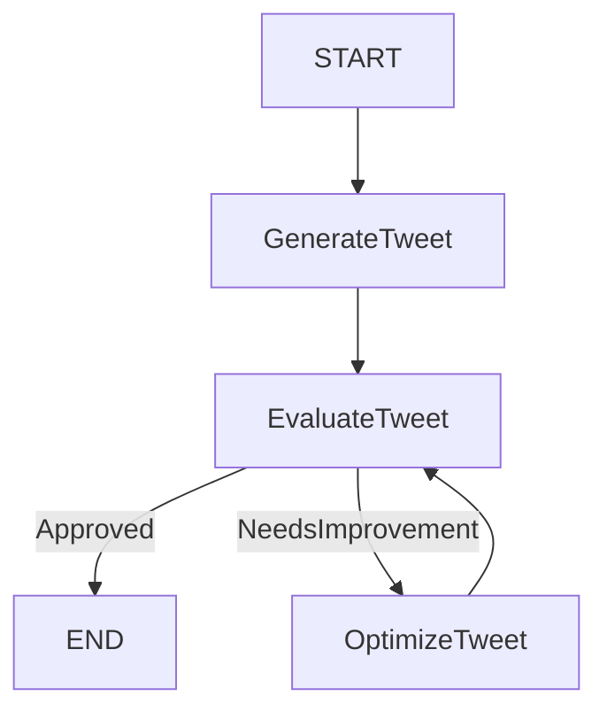

# Iterative Tweet Agent with LangGraph

This project implements an agentic workflow for generating, evaluating, and optimizing tweets using LangGraph and LangChain with OpenAI's GPT models.

## Overview

The agent follows an iterative process to ensure high-quality tweet generation:
1.  **Generate**: Creates an initial tweet based on a given topic.
2.  **Evaluate**: Critiques the tweet for relevance, engagement, and formatting.
3.  **Optimize**: Refines the tweet based on feedback if it needs improvement.
4.  **Loop**: Repeats the evaluation and optimization process until the tweet is approved or the maximum number of iterations is reached.

## Workflow Diagram



## Prerequisites

-   Python 3.10+
-   OpenAI API Key

## Installation

1.  Clone the repository:
    ```bash
    git clone https://github.com/MukundJahagirdar/Iterative_Tweet_Agent_Langgragh.git
    cd Iterative_Tweet_Agent_Langgragh
    ```

2.  Create and activate a virtual environment (optional but recommended):
    ```bash
    python3 -m venv .venv
    source .venv/bin/activate
    ```

3.  Install dependencies:
    ```bash
    pip install langgraph langchain-openai langchain-core pydantic python-dotenv
    ```

4.  Set up environment variables:
    Create a `.env` file in the root directory and add your OpenAI API key:
    ```env
    OPENAI_API_KEY=your_api_key_here
    ```

## Usage

Run the script to generate a tweet:

```bash
python3 IterativeWorkflow.py
```

You can modify the `initial_state` in `IterativeWorkflow.py` to change the topic or maximum iterations:

```python
initial_state={
    "topic": "Your Topic Here",
    # ...
    "maxIteration": 3
}
```

## Code Structure

-   `IterativeWorkflow.py`: Main script containing the graph definition, state management, and LLM interactions.
-   `TweetState`: TypedDict defining the state schema (topic, generated tweet, evaluation, feedback, iteration count).
-   `generate_tweet`, `evaluate_tweet`, `optimize_tweet`: Node functions for each step of the workflow.
-   `route_evaluation`: Conditional logic to determine the next step based on evaluation results.

## License

[MIT](https://choosealicense.com/licenses/mit/)
